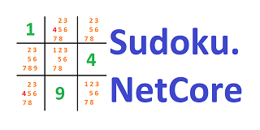

# Sudoku.NetCore

## Dot.Net Core implementation of a Sudoku-Solver
The Sudoku solver works on the principle of excluding the possible numbers (candidates) per cell.
Since a number may occur only once per cell, column and row, when a number is defined in the cell, this number is deleted as a possible number (candidate) in the cells of the corresponding columns and rows.

If finally only one possible number remains in a cell, column or row, this remaining number is set and thus another check is started.

Besides the simple reduction of the possibilities, there are several other strategies that reduce the possibilities even further.

## Rules
https://en.wikipedia.org/wiki/Sudoku

## Definition
**Digit** = One given Number (1 to 9) in a Cell

**Candidates** = Possible Digits (up to 9)

**Cell** = Has one digit or 1 to 9 candidates

**Box** = square of 3*3 cells

**Row** = 9 cells in a row

**Column** = 9 cells in a column
