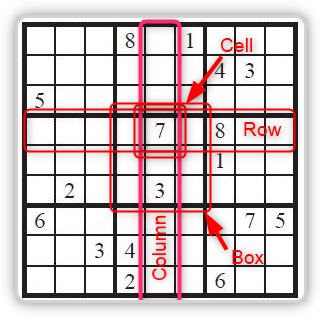

# Sudoku.NetCore

[](https://ci.appveyor.com/project/diogenes25/sudoku-netcore-jlyw2)
[](https://app.codacy.com/gh/diogenes25/Sudoku.NetCore/dashboard?utm_source=gh&utm_medium=referral&utm_content=&utm_campaign=Badge_grade)
[](https://github.com/diogenes25/Sudoku.NetCore/actions/workflows/codeql.yml)

## Dot.Net Core implementation of a Sudoku-Solver

Library for solving a Sudoku puzzle.

The solution process can be extended by own solution techniques.

The two solving strategies ***"Hidden Single"*** and ***"Naked Single"*** are already implemented.

The following solving strategies are already implemented and can be reloaded:

- Locked Candidates 
- Naked Pair
- Naked Triple
- Naked Quad
- Hidden Pair
- Hidden Triple
- Hidden Quad

Regardless of the solution strategies, backtracking (brute-force) is implemented.

## Rules

https://en.wikipedia.org/wiki/Sudoku

## Definition

**Board** = contains 81 cells organized in 9 rows, 9 columns and 9 boxes.

**Cell** = Has one digit or 1 to 9 candidates

**Box** = square of 3*3 cells

**Row** = 9 cells in a row

**Column** = 9 cells in a column

**Digit** = One given Number (1 to 9) in a Cell

**Candidates** = Possible Digits (up to 9)



## Background

A Sudoku has 81 cells, where each cell is part of a box, a row and a column.
At the beginning, each cell can receive a number between 1 and 9. 
After a cell has received a digit, this possible value is reduced for each cell that is also in the same box, column and row as the corresponding cell.

If the reduction of possibilities leaves only one possible number in a cell, column or row, this remaining number is set and thus starts a further reduction of possibilities for the affected cells.


But there are several other strategies that reduce the possibilities even further.

## Example

Start with a simple board.

```csharp
using DE.Onnen.Sudoku;

// create a simple board with 81 cells.
var board = new Board();
```

### Set a digit

There are several ways to set a digit in a cell:

```csharp
using DE.Onnen.Sudoku;

var board = new Board();

// Set digit with cellID.
board.SetDigit(cellID: 0, digitToSet: 1);

// Set digit 3 on the cell with ID 2:
// Read cell with ID 2 first
var cell2 = board[2];
// Set Digit 3 to this cell
cell2.SetDigit(3);

// Set digit 5 on the cell with ID 4. Shortversion
board[4].SetDigit(5);

```

### Read the candidates

At the beginning every cell, box, col or row has 9 candidates

**Example:**

```csharp
using DE.Onnen.Sudoku;

var board = new Board();

// Read the candidates (collection of int) from cell 0
var candidatesFromCell0 = board[0].Candidates;
Console.Write("Candidates from Cell:0 => ");
Console.WriteLine(String.Join(",", candidatesFromCell0));

// Set digit in cell 1 (right beside cell 0)
board[1].SetDigit(1);
candidatesFromCell0 = board[0].Candidates;
Console.Write("Candidates from Cell:0 after Cell:1 got digit 1 => ");
Console.WriteLine(String.Join(",", candidatesFromCell0));

// Check candidates from first box.
var boxUpperLeft = board.GetHouse(EHouseType.Box, 0);
Console.Write("Candidates from first box (Upper Left) where Cell 1 is part of => ");
Console.WriteLine(String.Join(",", boxUpperLeft.Candidates));
```

**Output:**

```console
Candidates from Cell:0 => 1,2,3,4,5,6,7,8,9
Candidates from Cell:0 after Cell:1 got digit 1 => 2,3,4,5,6,7,8,9
Candidates from first box (Upper Left) where Cell 1 is part of => 2,3,4,5,6,7,8,9
```

You see that the cadidate 1 is removed in Cell:0 after the digit 1 was set in Cell:1